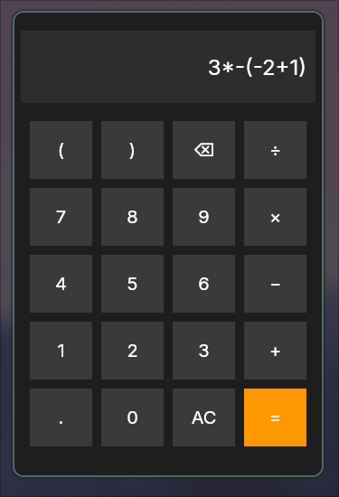
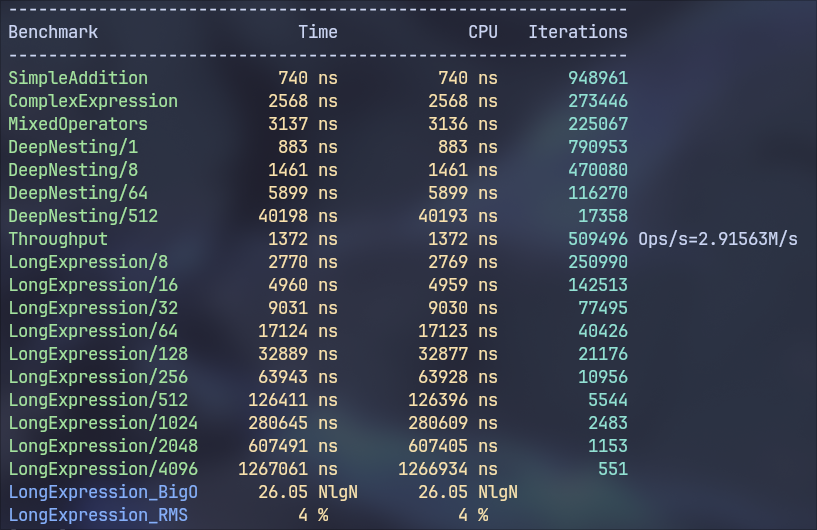
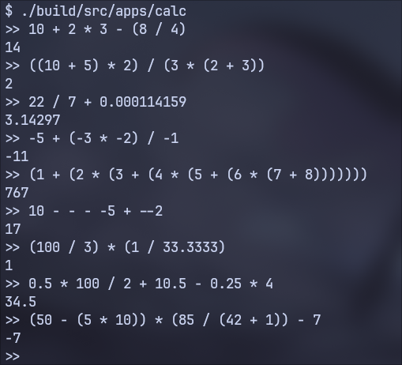
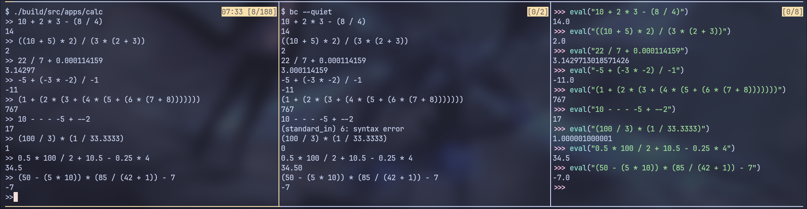
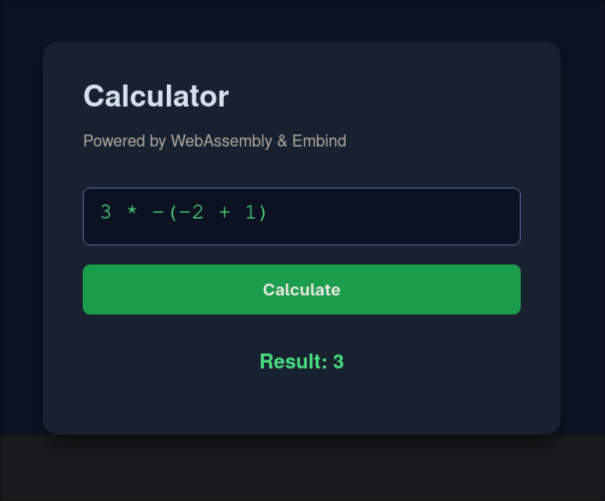
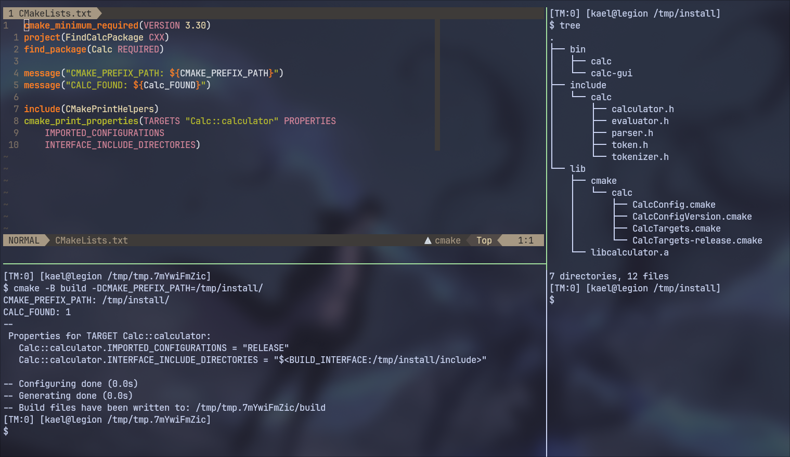
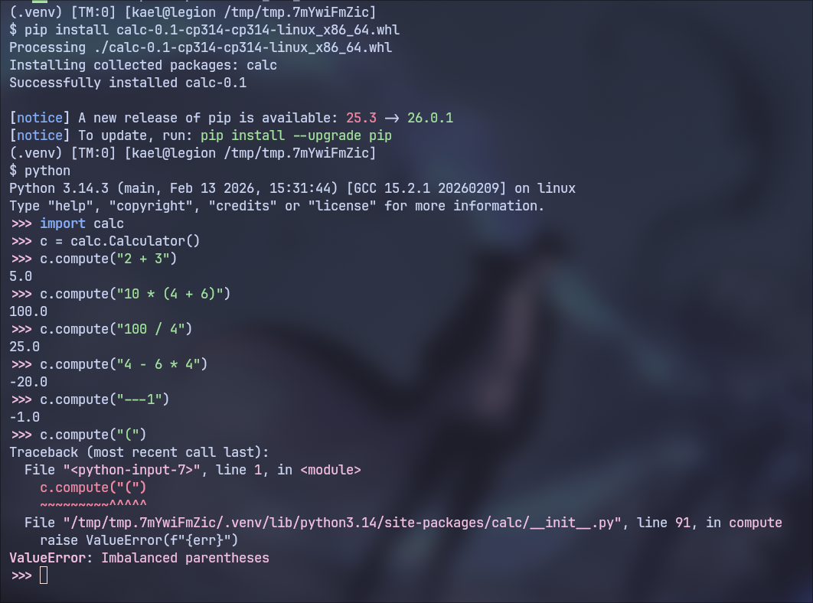

# Calculator

A modular calculator library and application written in modern **C++23**.



The project implements a complete expression evaluation pipeline:

```
string expression
      │
      ▼
Tokenizer  →  Parser (Shunting Yard)  →  Evaluator
      │                 │                   │
      ▼                 ▼                   ▼
   Tokens        Postfix (RPN)          double
```

The repository includes:

* A reusable **Calculator library**
* A **CLI application**
* A **GUI application**
* Optional **language bindings**
* **Unit tests**
* **Fuzz testing**
* **Benchmarks**
* **Code coverage reports**

---

## Quick Start

```bash
git clone https://github.com/<user>/calculator
cd calculator
cmake -B build
cmake --build build
./build/src/apps/calc
```

---

## Features

* Modern **C++23**
* Fully modular architecture
* Unary operator support (`+` / `-`)
* Floating point arithmetic
* Parentheses and operator precedence
* GoogleTest based unit tests
* libFuzzer fuzz testing
* Google Benchmark performance tests
* Coverage reports using `gcovr`
* Installable CMake package
* Optional language bindings

---

## Project Structure

```
.
├── src
│   ├── apps
│   │   ├── calc_cli.cc
│   │   └── calc_gui.cc
│   │
│   └── libs
│       ├── core
│       │   ├── tokenizer
│       │   ├── parser
│       │   ├── evaluator
│       │   └── calculator
│       │
│       └── bindings
│           ├── c
│           ├── python
│           └── javascript
│
├── test
├── bench
├── fuzz
└── cmake
```

Core components:

| Component  | Responsibility                                  |
| ---------- | ----------------------------------------------- |
| Tokenizer  | Converts raw input string to tokens             |
| Parser     | Converts infix tokens → postfix (Shunting Yard) |
| Evaluator  | Evaluates postfix expressions                   |
| Calculator | High level API combining the above              |

---

## Build

### Requirements

* CMake **≥ 3.30**
* C++23 compatible compiler

---

### Basic build

```
git clone <repo>
cd calc

cmake -B build
cmake --build build
```

Run CLI:

```
./build/src/apps/calc
```

---

## CMake Options

| Option                | Description             |
| --------------------- | ----------------------- |
| `BUILD_TESTS`         | Build unit tests        |
| `BUILD_BENCHMARKS`    | Build benchmarks        |
| `BUILD_FUZZERS`       | Build fuzz tests        |
| `BUILD_LANG_BINDINGS` | Build language bindings |
| `ENABLE_SANITIZERS`   | Enable UBSan            |
| `ENABLE_CLANG_TIDY`   | Run clang-tidy          |
| `ENABLE_CLANG_FORMAT` | Enable format target    |
| `BUILD_ALL`           | Enable everything       |

Example:

```
cmake -B build -DBUILD_ALL=ON
```

---

## Running Tests

```
cmake -B build -DBUILD_TESTS=ON
cmake --build build
ctest --test-dir build
```

---

## Coverage

```
cmake -B build -DBUILD_TESTS=ON
cmake --build build --target coverage
```

Produces:

```
coverage.html
```

You can browse the hosted coverage report online:

http://calculator.infinage.space/coverage

---

## Benchmarks

Uses **Google Benchmark**.

```
cmake -B build -DBUILD_BENCHMARKS=ON
cmake --build build --target bench
```

Results are exported to:

```
bench.json
```

Sample results:



---

## Fuzz Testing

Uses **libFuzzer**.

```
cmake -B build -DBUILD_FUZZERS=ON
cmake --build build --target fuzz
```

Runs fuzzing for 60 seconds by default.

---

## CLI Usage

Example:

```
$ calc
> 1 + 2 * 3
7
```



---

## CLI Comparison

Comparison with `bc` and `Python` eval.



---

## GUI

The project includes a lightweight GUI using **webview**.

```
calc-gui
```

---

## Web (WebAssembly)

The calculator can run in the browser via WebAssembly.

Try it here: http://calculator.infinage.space



---

## Using as a Library

Example:

```cpp
#include <calc/calculator.h>

Calc::Calculator calc;

auto res = calc.compute("3 + 4 * 2 / (1 - 5)");

if (res)
    std::cout << *res;
else
    std::cerr << res.error();
```

---

## Installation

```
cmake -B build
cmake --build build
cmake --install build
```

Then use via CMake:

```
find_package(Calc REQUIRED)
target_link_libraries(my_app PRIVATE Calc::calculator)
```



---

## Language Bindings

Optional bindings:

| Language   | Status                   |
| ---------- | ------------------------ |
| C          | Shared library           |
| Python     | Python wheel             |
| JavaScript | WebAssembly (Emscripten) |

Enable with:

```
-DBUILD_LANG_BINDINGS=ON
```



---

## Documentation

Doxygen docs can be generated with:

```
cmake --build build --target docs
```

Generated in:

```
docs/
```

You can browse the hosted documentation online:

http://calculator.infinage.space/docs

---

## Packaging

Release packages can be generated using **CPack**:

```
cpack -G "TGZ;DEB"
```

---

## License

MIT License
